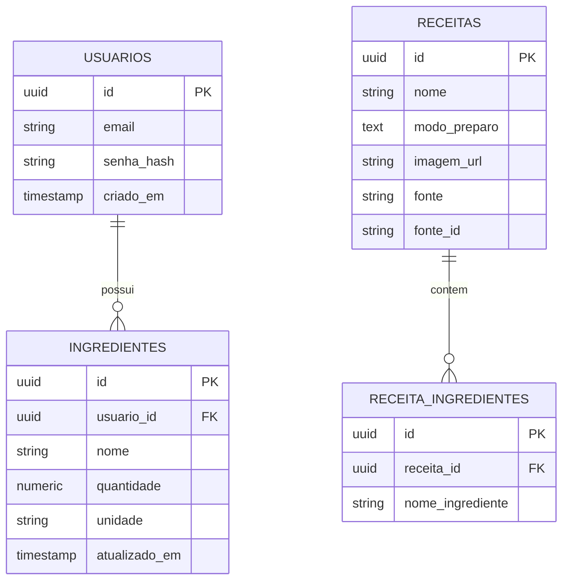

# Diagrama Entidade-Relacionamento — Banco de Dados Talherzim

Modelagem de dados do projeto "Organizador de Receitas com Sugestão por
Ingredientes Disponíveis" (task #2). Referência: documento de levantamento
de requisitos (RF01–RF11, RNF06, RNF07).



## Decisões de modelagem

- **PostgreSQL** foi escolhido em vez de MongoDB porque o domínio tem
  relações claras (usuário 1:N ingredientes, receita 1:N ingredientes) e o
  requisito de ranqueamento (RF07) é uma operação de JOIN + agregação,
  naturalmente simples em SQL.
- **receitas** e **receita_ingredientes** existem como tabelas próprias
  mesmo priorizando a API Spoonacular, para cumprir a contingência exigida
  pelo RNF07: se a API cair, o sistema consulta os mesmos dados sem mudar
  a lógica de matching.
- **receita_ingredientes.nome_ingrediente** é texto livre (não FK para
  `ingredientes`), pois uma receita não pertence a um usuário — ela é
  comparada contra a despensa de qualquer usuário que fizer a busca.

## Índices

| Índice | Motivo |
|---|---|
| `ingredientes(usuario_id)` | Acelera listar a despensa (RF05) e o JOIN do matching |
| `lower(ingredientes.nome)` | Comparação de nomes case-insensitive |
| `lower(receita_ingredientes.nome_ingrediente)` | Idem, do lado da receita |
| `receita_ingredientes(receita_id)` | Acelera buscar ingredientes de uma receita |
| `receitas(fonte, fonte_id)` único | Evita duplicar receita importada duas vezes |

## Query de validação (RF07)

```sql
SELECT r.id, r.nome, COUNT(*) AS ingredientes_compativeis
FROM receitas r
JOIN receita_ingredientes ri ON ri.receita_id = r.id
JOIN ingredientes i ON lower(i.nome) = lower(ri.nome_ingrediente)
                    AND i.usuario_id = :usuario_id
GROUP BY r.id, r.nome
ORDER BY ingredientes_compativeis DESC;
```
