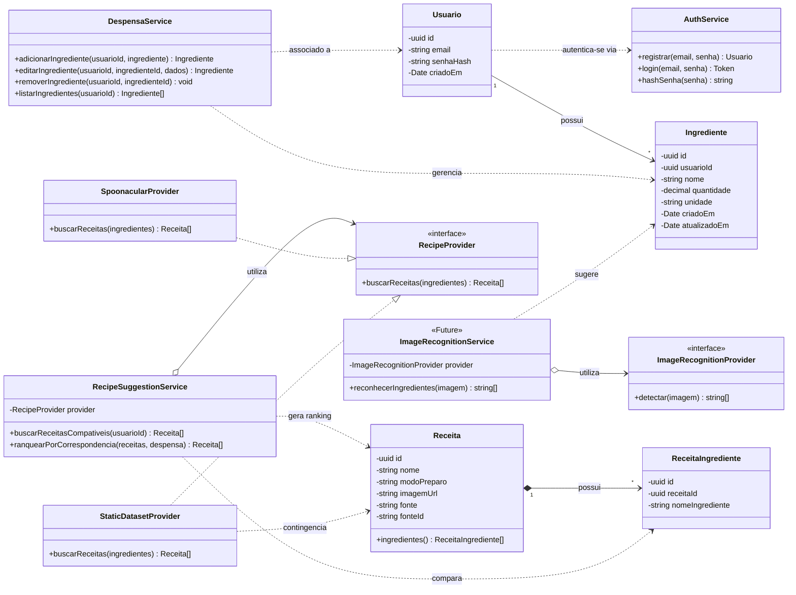

# Diagrama de Classes

Este documento apresenta o diagrama de classes do sistema, incluindo as entidades principais, serviços, provedores de dados e relacionamentos entre os componentes.

##  Estrutura do Sistema

## Relacionamentos Principais

| Relacionamento                 | Descrição                                                              |
| ------------------------------ | ---------------------------------------------------------------------- |
| `Usuario → Ingrediente`        | Um usuário possui vários ingredientes em sua despensa.                 |
| `Receita → ReceitaIngrediente` | Uma receita é composta por vários ingredientes.                        |
| `AuthService`                  | Responsável pelo registro e autenticação dos usuários.                 |
| `DespensaService`              | Gerencia os ingredientes da despensa do usuário.                       |
| `RecipeSuggestionService`      | Busca e ranqueia receitas compatíveis com os ingredientes disponíveis. |
| `RecipeProvider`               | Define um contrato para diferentes fontes de receitas.                 |
| `SpoonacularProvider`          | Implementa a integração com a API Spoonacular.                         |
| `StaticDatasetProvider`        | Fornece uma fonte alternativa de receitas para contingência.           |
| `ImageRecognitionService`      | Funcionalidade futura para identificação de ingredientes por imagem.   |
