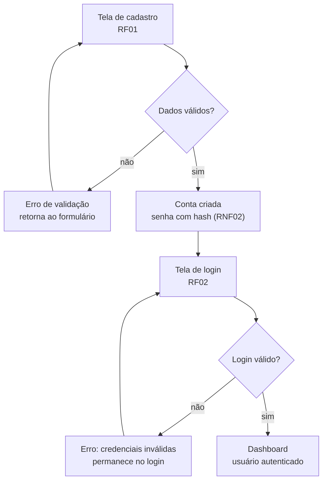
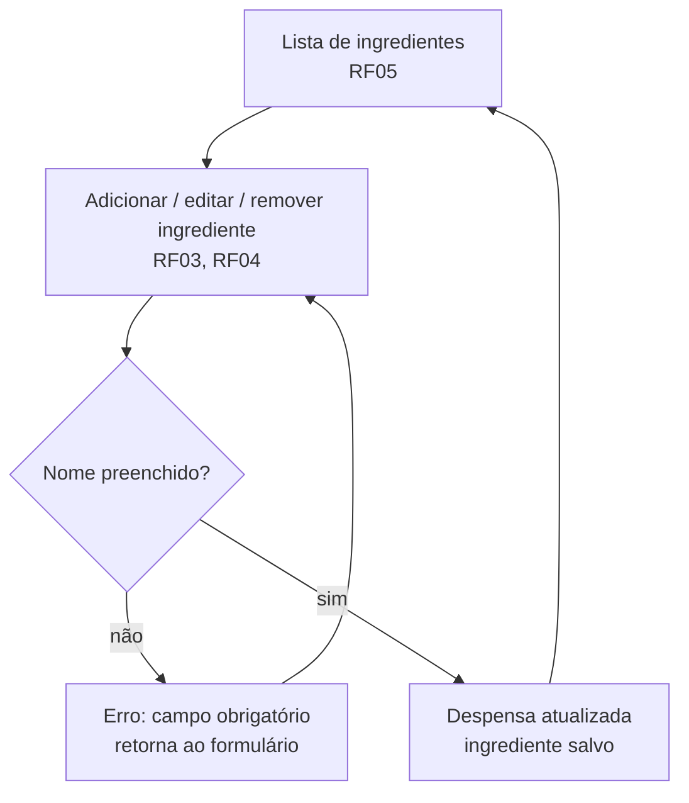
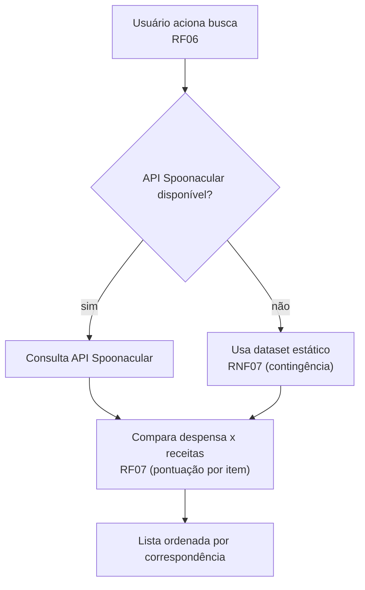
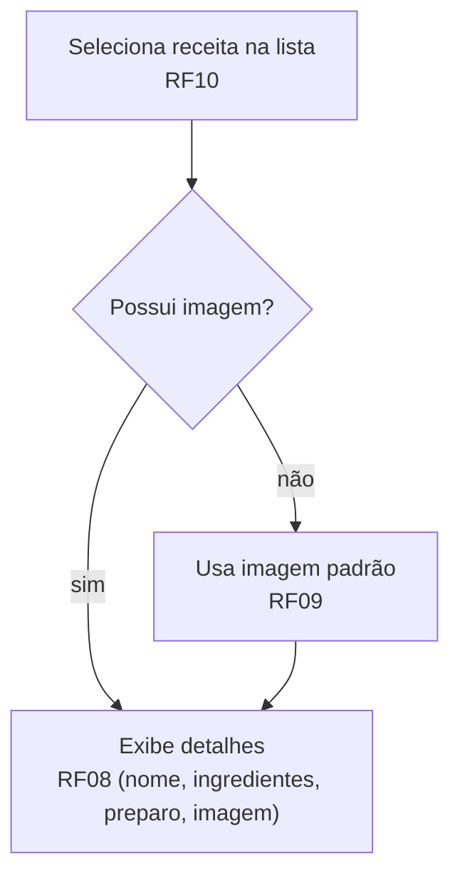
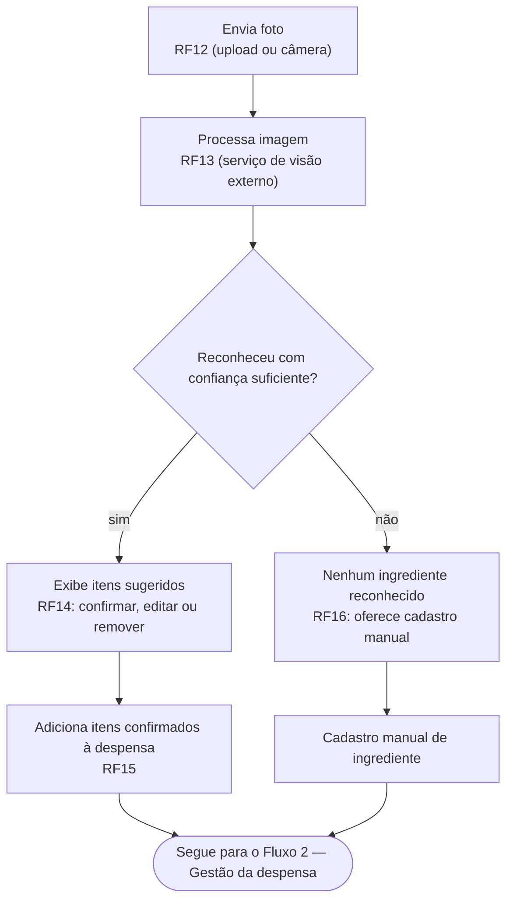

# Modelagem de Fluxo do APP

**Projeto:** Organizador de Receitas com Sugestão por Ingredientes Disponíveis (Talherzim)
**Issue relacionada:** [#3 — Modelagem de Fluxo do APP](https://github.com/Talhezim-Receitas-Rapidas/talherzim-documentation/issues/3)
**Base:** Documento de Levantamento de Requisitos (RF/RNF) + Detalhamento de Tarefas — Talherzim Backend

Este documento mapeia os fluxos de navegação/uso principais do aplicativo, cobrindo entrada e saída de cada tela, conforme pedido na tarefa #2 do board (*Modelagem de Fluxo do APP*). Cada fluxo indica em qual etapa cada requisito funcional (RFxx) é atendido e cobre pelo menos um caminho de erro/exceção.

Os diagramas usam sintaxe Mermaid, renderizada nativamente pelo GitHub ao visualizar este arquivo `.md` no repositório — não é necessário nenhum visualizador externo.

---

## 1. Cadastro e login (RF01, RF02)

Fluxo obrigatório de prioridade 1/2 do stakeholder: toda a autenticação, com os dois pontos de decisão e seus respectivos erros.

**Caminho de erro coberto:** dados de cadastro inválidos; senha incorreta no login.

---

## 2. Gestão da despensa (RF03, RF04, RF05)

Fluxo cíclico: qualquer ação (adicionar, editar, remover) retorna à listagem atualizada.

**Caminho de erro coberto:** campo obrigatório (nome do ingrediente) vazio.

---

## 3. Sugestão de receitas (RF06, RF07, RNF07)

Ponto de decisão crítico para a resiliência do MVP: indisponibilidade da API externa cai no dataset estático (RNF07), sem interromper o fluxo do usuário.

**Caminho de erro/exceção coberto:** API externa indisponível.

---

## 4. Detalhe da receita (RF08, RF09, RF10)

**Caminho de erro/exceção coberto:** receita sem imagem disponível na fonte de dados.

---

## 5. Reconhecimento de ingredientes por foto — opcional / stretch goal (RF12–RF16)

Fluxo adicional, condicionado à disponibilidade de tempo (Seção 6 do documento de requisitos). Ao final, os itens confirmados alimentam o Fluxo 2 (Gestão da despensa).

**Caminho de erro/exceção coberto:** nenhum ingrediente reconhecido com confiança suficiente → oferece cadastro manual (RF16). Falha do serviço de reconhecimento é tratada de forma equivalente, sem interromper o restante da aplicação (RNF13).

---

## 6. Rastreabilidade — fluxo x requisito x caminho de erro

| Fluxo | RFs/RNFs cobertos | Caminho de erro/exceção |
|---|---|---|
| 1. Cadastro e login | RF01, RF02, RNF02 | Cadastro com dados inválidos; login com senha incorreta |
| 2. Gestão da despensa | RF03, RF04, RF05 | Nome do ingrediente vazio |
| 3. Sugestão de receitas | RF06, RF07, RNF07 | API Spoonacular indisponível → dataset estático |
| 4. Detalhe da receita | RF08, RF09, RF10 | Receita sem imagem → imagem padrão |
| 5. Reconhecimento de imagem (opcional) | RF12, RF13, RF14, RF15, RF16, RNF13 | Nenhum ingrediente reconhecido com confiança → cadastro manual |

## 7. Observações para a issue #3

- Os fluxos 1 a 4 correspondem às Prioridades 1 e 2 do stakeholder (autenticação, despensa, sugestão, detalhe) e devem ser tratados como bloqueantes para o critério de aceite do MVP.
- O fluxo 5 é o incremento opcional descrito na Seção 6 do documento de requisitos — só deve ser implementado após a estabilização dos fluxos 1 a 4, e sua ausência não bloqueia a entrega.
- Este arquivo pode ser adicionado à pasta de documentação do repositório `talherzim-documentation` (ex.: `docs/modelagem-fluxo-app.md`) e referenciado diretamente na issue #3, já que o GitHub renderiza os blocos Mermaid automaticamente ao abrir o arquivo.
